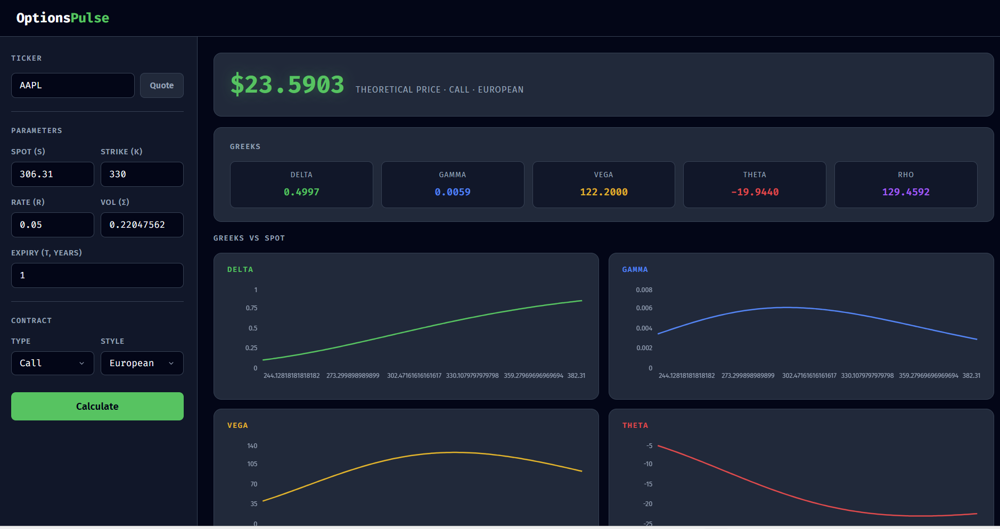
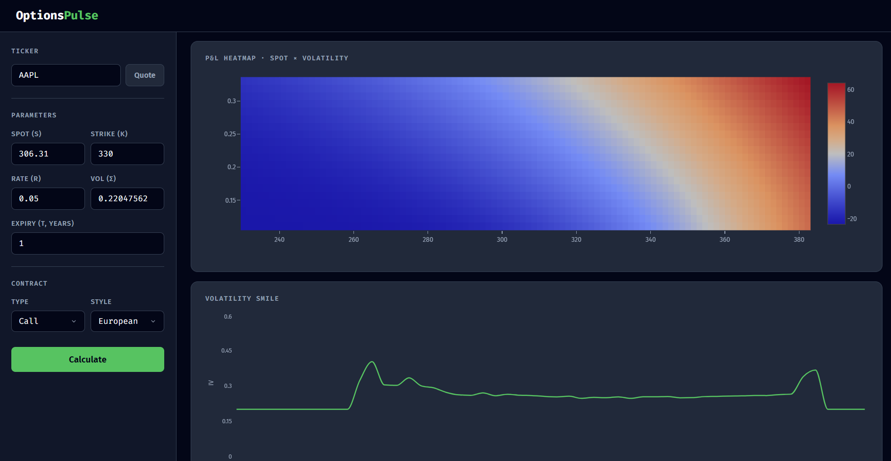

# GreekDesk

A full-stack options pricing platform built from scratch. The core pricing engine is written in C++ and exposed to a Python/FastAPI backend via pybind11. A React dashboard renders prices, Greeks, P&L heatmaps, and live volatility smiles.



note: name changed from OptionsPulse to GreekDesk
---

## Architecture

```
┌─────────────────────────────────────────────────────┐
│  React Frontend  (Recharts + Plotly, dark OLED UI)  │
└────────────────────────┬────────────────────────────┘
                         │ HTTP (localhost:3000 → 8000)
┌────────────────────────▼────────────────────────────┐
│  FastAPI Backend  (Python)                          │
│  /price  /greeks  /greekgraphs  /pnl  /vol_smile   │
│  /quote  /implied_vol                               │
└──────────┬──────────────────────┬───────────────────┘
           │ pybind11             │ yfinance
┌──────────▼──────────┐  ┌───────▼──────────────────┐
│  C++ Pricing Engine │  │  PostgreSQL (SQLAlchemy)  │
│  Black-Scholes      │  │  pricing_history          │
│  Greeks (×5)        │  │  saved_positions          │
│  Newton-Raphson IV  │  └──────────────────────────┘
└─────────────────────┘
```

---

## Features

- **Options Pricing** — Black-Scholes for European calls and puts
- **Greeks** — Delta, Gamma, Vega, Theta, Rho computed analytically in C++
- **Implied Volatility** — Newton-Raphson solver; inverts the BS formula given a market price
- **Volatility Smile** — Fetches real options chain from yfinance, computes IV at each strike, plots IV vs K
- **P&L Heatmap** — P&L across a grid of spot prices × volatilities (Plotly heatmap)
- **Greeks Charts** — Each Greek plotted vs spot price over a range
- **Live Quote** — Auto-fills spot price (S) and historical volatility (σ) from ticker
- **Pricing History** — Every calculation logged to PostgreSQL

---

## Tech Stack

| Layer | Technology |
|-------|-----------|
| Pricing engine | C++17, Black-Scholes, Newton-Raphson |
| Python bridge | pybind11 |
| Backend | FastAPI, SQLAlchemy, yfinance |
| Database | PostgreSQL |
| Frontend | React, Recharts, Plotly.js |
| Build | CMake, MinGW (Windows) |

---

## Project Structure

```
greekdesk/
├── engine/
│   ├── include/pricer.h       # C++ declarations
│   └── src/pricer.cpp         # Black-Scholes, Greeks, Newton-Raphson
├── backend/
│   ├── bindings.cpp           # pybind11 module definition
│   ├── main.py                # FastAPI app + all endpoints
│   ├── models.py              # SQLAlchemy ORM models
│   └── database.py            # DB engine + session factory
├── frontend/
│   └── src/
│       ├── App.js             # Main dashboard component
│       └── App.css            # Dark OLED design system
├── app/
│   └── main.cpp               # Standalone C++ test binary
└── CMakeLists.txt
```

---

## Local Setup

### Prerequisites

- Python 3.14
- Node.js 18+
- PostgreSQL
- CMake + MinGW (Windows) or GCC (Linux/Mac)
- pybind11

### 1. Build the C++ engine

```bash
cmake -S . -B build -G "MinGW Makefiles"
cmake --build build
copy build\greekdesk.cp314-win_amd64.pyd backend\
```

### 2. Configure the database

Create a `.env` file in the project root:

```
DB_PASSWORD=your_postgres_password
```

Create the database in PostgreSQL:

```sql
CREATE DATABASE greekdesk;
```

Then create the tables:

```bash
cd backend
python -c "from database import Base, engine; from models import *; Base.metadata.create_all(engine)"
```

### 3. Run the backend

```bash
python -m uvicorn backend.main:app --reload
```

### 4. Run the frontend

```bash
cd frontend
npm install
npm start
```

The dashboard opens at `http://localhost:3000`.

---

## API Endpoints

| Method | Endpoint | Description |
|--------|----------|-------------|
| POST | `/quote` | Fetch live spot price + historical vol for a ticker |
| POST | `/price` | Compute Black-Scholes option price |
| POST | `/greeks` | Compute all 5 Greeks |
| POST | `/greekgraphs` | Greeks vs spot over a range (for charts) |
| POST | `/pnl` | P&L grid across spot × volatility |
| POST | `/implied_vol` | Implied volatility from a single market price |
| POST | `/vol_smile` | IV at every strike for the nearest listed expiry |

---

## Mathematical Foundation

The pricing engine is grounded in stochastic calculus and the Black-Scholes PDE derivation.

### Brownian Motion

Constructed as the limit of a symmetric random walk. Four defining properties: $W_0 = 0$, independent increments, $W_t - W_s \sim \mathcal{N}(0, t-s)$, continuous paths. Nowhere differentiable — fractal and self-similar. The key differential: $dW_t \sim \mathcal{N}(0, dt)$.

### Geometric Brownian Motion

$$dS = \mu S \, dt + \sigma S \, dW_t$$

Models log-returns (not absolute price changes), ensuring $S > 0$ always. The lognormality of $S$ follows directly.

### Itô's Lemma

For a function $V(S, t)$, Taylor expansion to second order with the Itô rule $(dW_t)^2 = dt$:

$$dV = \frac{\partial V}{\partial t}dt + \frac{\partial V}{\partial S}dS + \frac{1}{2}\sigma^2 S^2 \frac{\partial^2 V}{\partial S^2}dt$$

The correction term $\frac{1}{2}\sigma^2 S^2 \frac{\partial^2 V}{\partial S^2}$ is the Itô term — absent in ordinary calculus, essential here.

### Black-Scholes PDE

Derived via delta hedging: construct a portfolio $\Pi = V - \Delta S$ that is instantaneously riskless. By no-arbitrage it must earn the risk-free rate. Applying Itô's Lemma and setting $\Delta = \frac{\partial V}{\partial S}$ eliminates all stochastic terms. $\mu$ drops out entirely:

$$\frac{\partial V}{\partial t} + rS\frac{\partial V}{\partial S} + \frac{1}{2}\sigma^2 S^2 \frac{\partial^2 V}{\partial S^2} - rV = 0$$

### Solving the PDE

Transformed to the heat equation via substitutions $x = \ln S$, $\tau = T - t$, $V = e^{\alpha x + \beta \tau} u$. The heat equation has a known Green's function solution, which — after reversing the substitutions — yields the closed form.

### Closed-Form Formula (European Call)

$$V = S \, \mathcal{N}(d_1) - K e^{-r(T-t)} \mathcal{N}(d_2)$$

$$d_1 = \frac{\ln(S/K) + (r + \frac{1}{2}\sigma^2)(T-t)}{\sigma\sqrt{T-t}}, \qquad d_2 = d_1 - \sigma\sqrt{T-t}$$

$\mathcal{N}(d_2)$ is the risk-neutral probability of expiring in the money. $\mathcal{N}(d_1)$ is $\mathcal{N}(d_2)$ shifted by $\sigma\sqrt{T-t}$, accounting for receiving the stock rather than cash. $\mathcal{N}(d_1) = \Delta$.

---

## Notes

- American options raise a `NotImplementedError` — binomial tree implementation is planned (Phase 5)
- Volatility smile uses bid/ask midpoint for live pricing; filters strikes to ±30% of spot, removes contracts priced below intrinsic value, and drops IV readings outside [1%, 200%]
- The `.pyd` binary is platform-specific; recompilation is required on Linux/Mac
